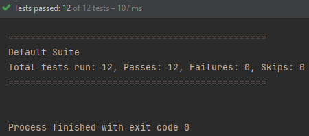

# String Calculator using TDD Kata

#### Create a simple String Calculator which has a method signature:

1. In a test-first manner, create a simple `class StringCalculator`
   with a method `public int Add(string numbers)`
   - The method can take 0, 1 or 2 numbers, and will return their `sum`
   (for an empty string it will return 0)
   for example
   `“” == 0 , “1” == 1 , “1,2” == 3`
   - Start with the simplest test case of an empty string and move to one & two
   numbers
   - Remember to solve things as simply as possible so that you force yourself to
   write tests you did not think about
   - Remember to `refactor` after each passing test

2. Allow the `Add` method to handle an unknown amount of numbers
3. Allow the `Add` method to handle `new lines` between numbers (instead of commas).
   1. the following input is ok: “1\n2,3” == 6
   2. the following is `INVALID input` so do not expect it : “1,\n” (not need to write a
   test for it)
4. Support different delimiters:
   to change a delimiter, the beginning of the string will contain a separate line
   that looks like this: 
   `“//[delimiter]\n[numbers…]”` 
      for example 
      `“//;\n1;2” == 3` 
      since the default delimiter is ‘;’. 
      **Note:** All existing scenarios and tests should still be supported
5. Calling `Add` with a `negative number` will throw an `exception “negatives not allowed”` -
   and the `negative that was passed`.
6. If there are <u>multiple negatives</u>, show all of them in the `exception message`
7. Using `TDD`, Add a method to `StringCalculator`
   called `public int GetCalledCount()`
   that returns how many times `Add()` was invoked. 
   **Remember** - Start with a failing (or even non compiling) test.
8. Numbers bigger than `1000` should be <u>ignored</u>, for example:
   `2 + 1001 == 2`
9. Delimiters can be of any length with the following format:
   `“//[delimiter]\n”` 
   for example: 
   `“//[***]\n1***2***3” == 6`
10. Allow multiple delimiters like this:
    `“//[delim1][delim2]\n”` 
    for example 
    `“//[*][%]\n1*2%3” == 6.`
11. make sure you can also handle multiple delimiters with length longer than one char
    for example 
    `“//[**][%%]\n1**2%%3” == 6.`

## Folder Structure

    src
    .
    ├── main                    # Contains Production Code in Java
    ├── test                    # Contains Java Test Code

**Note:** Test directory contains various testcases which to be performed on implemented methods.

## OUTPUT

## Tools Used
    - java 16
    - TestNG